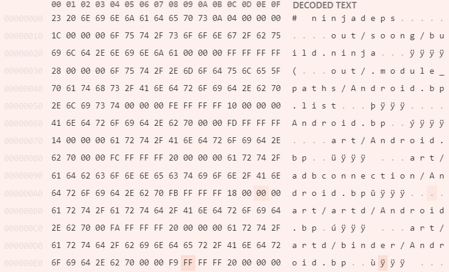

# ninja\_deps

这里主要分析 ninja 的 \.ninja\_deps 文件。

## 1. 跟踪 NinjaMain::ToolGraph

在这里，我们希望分析的是 tools 中的 graph 工具：

```cpp
// src/ninja.cc
static const Tool kTools[] = {
    // 省略了一些 tools
    { "deps", "show dependencies stored in the deps log",
      Tool::RUN_AFTER_LOGS, &NinjaMain::ToolDeps },
    { "graph", "output graphviz dot file for targets",
      Tool::RUN_AFTER_LOAD, &NinjaMain::ToolGraph },
  };
```

可以看到 graph 的使用时间是在 LOAD 之后。这个 RUN_AFTER_LOAD 标志会在 real_main 中生效。这里 的 load 指的是 parser 的 Load 方法：

```cpp
// src/ninja.cc real_main 中
    ManifestParser parser(&ninja.state_, &ninja.disk_interface_, parser_opts);
    string err;
    if (!parser.Load(options.input_file, &err)) {
      status->Error("%s", err.c_str());
      exit(1);
    }

    if (options.tool && options.tool->when == Tool::RUN_AFTER_LOAD)
      exit((ninja.*options.tool->func)(&options, argc, argv));
```

这个 Load 方法在 manifest_parser.cc 中。ManifestParser 的主要目的是将 state\_ 填入，所以我们可以直接看到 Load 中调用的 ManifestLoader::Load。

在 state\_ 装填完毕过后，直接调用 ToolGraph。也就是说，ToolGraph 是不使用 \.ninja\_deps 文件的，它只是解析 build\.ninja 文件。

**只有 RUN_AFTER_LOGS** 的 Tool 才有可能使用 \.ninja\_deps 文件！！！！

```cpp
// src/ninja.cc
int NinjaMain::ToolGraph(const Options* options, int argc, char* argv[]) {
  vector<Node*> nodes;
  string err;
  if (!CollectTargetsFromArgs(argc, argv, &nodes, &err)) {
    Error("%s", err.c_str());
    return 1;
  }

  GraphViz graph(&state_, &disk_interface_);
  graph.Start();
  for (vector<Node*>::const_iterator n = nodes.begin(); n != nodes.end(); ++n)
    graph.AddTarget(*n);
  graph.Finish();

  return 0;
}
```

这就是为什么在 ToolGraph 中没有看到 deps\_log 的原因。

这里需要详述一下 GraphViz 描述的依赖关系，需要详述一下 dot 文件的格式。

### i. dot 文件

首先附一个 dot 官网：http://www.graphviz.org/doc/info/lang.html

```dot
digraph graph_name {

}
```

在这个大括号里面，用的最多的是 4 种指令：

1. 参数列表。形式为：`a="a_val"`；
2. node / edge / graph 属性语句。以 node 为例，形式为：`node [fontsize=10, shape=box, heigth=0.25]`；
3. node 语句，定义一个 node。给定一个 node id（还可以附上 label）：`"000001efe8f652e0" [label="phony", shape=ellipse]`；
4. edge 语句，定义一个 edge。给定两个 node id：`"000001efe8f14840" -> "000001efe8f1d2e0" [arrowhead=none]`。

大概就是这样。

### ii. AddTarget

由于 ToolGraph 会使用 CollectTargetsFromArgs 收集 Targets，并放入 nodes 中。（就是获得了 targets 对应的 nodes 们）

接下来就会按照 dfs 遍历。因为一个 Target 就是一个树的根节点。好比我指定了 ninja 中的 ”doc/manual.html“ 作为 Target，那它返回回来的图：


先是 doc/manual.html 节点，它的 in_edge 的 rule 是 xsltproc。xsltproc rule 的 inputs 是 build/manual.xml / doc/style.css / doc/docbook.xsl。

但是对于 doc/manual.html 这么一个 node，其 AddTarget 函数到 **解析完 xsltproc 有哪些 inputs** 也就结束了。对于 in_edge 连接的 inputs 会调用 AddTarget：

```cpp
void GraphViz::AddTarget(Node* node) {
  // 省略了一些代码
  Edge* edge = node->in_edge();
  // 省略了一些代码
  for (vector<Node*>::iterator in = edge->inputs_.begin();
       in != edge->inputs_.end(); ++in) {
    AddTarget(*in);
  }
}
```


**那么我要写的东西和它完全是反着来的**。应该是我找到一个节点（节点还是要找），然后去看它的所有 out_edges。看那些 out_edges 连接的其他 node 是来自什么 pkg / module。**也就是上图中 build/manual.xml 和 doc/style.css 之间的关系**。

## 2. 创建 \.ninja\_deps

首先会进入 real_main 函数，在这个函数中，会在 parser 解析完 build\.ninja 文件后调用：

```cpp
    if (!ninja.OpenBuildLog() || !ninja.OpenDepsLog())
      exit(1);
```

这个 ninja\.OpenDepsLog 就与 \.ninja\_deps 有关。

```cpp
// src/ninja.cc
bool NinjaMain::OpenDepsLog(bool recompact_only) {
  string path = ".ninja_deps";

  // 省略一些代码

  if (!deps_log_.Load(path, &state_, &err)) {
    Error("loading deps log %s: %s", path.c_str(), err.c_str());
    return false;
  }

  if (recompact_only) {
    bool success = deps_log_.Recompact(path, disk_interface_, &err);
    if (!success)
      Error("failed recompaction: %s", err.c_str());
    return success;
  }

  if (!config_.dry_run) {
    if (!deps_log_.OpenForWrite(path, disk_interface_, &err)) {
      Error("opening deps log: %s", err.c_str());
      return false;
    }
  }

  return true;
}
```

这里一共调用了三个重要方法：Load / Recompact / OpenForWrite，接下来我先不一个个分析，而是说一下这里使用的 deps\_log\_ 的类型：DepsLog：

```cpp
struct DepsLog {
  // Writing (build-time) interface.
  bool OpenForWrite(const string& path, const DiskInterface& disk, string* err);
  bool RecordDeps(Node* node, TimeStamp mtime, const vector<Node*>& nodes);
  bool RecordDeps(Node* node, TimeStamp mtime, int node_count, Node** nodes);
  void Close();

  // Reading (startup-time) interface.
  struct Deps {/* 省略 */};
  bool Load(const string& path, State* state, string* err);
  Deps* GetDeps(Node* node);

  /// Rewrite the known log entries, throwing away old data.
  bool Recompact(const string& path, const DiskInterface& disk, string* err);

 private:
  bool needs_recompaction_;
  FILE* file_;
  /// Maps id -> Node.
  vector<Node*> nodes_;
  /// Maps id -> deps of that id.
  vector<Deps*> deps_;
};
```

DepsLog 大致可分为三个部分：

* Writing 方面：在构建的时候使用，会输出 \.ninja\_deps；
* Reading 方面：在 ninja 启动的时候使用，会读入 \.ninja\_deps 到 ninja 的 State 中；
* Rewrite 方面：如果在构建时发现有非常多废弃的文件，那么会重写 \.ninja\_deps。

所以 OpenDepsLog 中使用 Load / Recompact / OpenForWrite 分别对应着 Reading / Writing / Rewrite。

### i. Load 过程

首先是 Load，字面上看这就是把 \.ninja\_deps 加载到 state\_ 中的方法。这里再回顾一下 NinjaMain 中的 state\_，它具备整个 ninja 运行的所有必备要素：

```cpp
// src/state,h
struct State {
  Paths paths_;
  /// All the pools used in the graph.
  std::unordered_map<HashedStrView, Pool*> pools_;
  /// All the edges of the graph.
  vector<Edge*> edges_;
  vector<Node*> defaults_;
}
```

在 Load 里面，使用了 OpenDepsLogForReading 将文件系统中的 \.ninja\_deps 文件读取到 DepsLogInputFile 类型变量中：

```cpp
struct DepsLogInputFile {
  std::unique_ptr<LoadedFile> file;
  DepsLogData data;
};
```

这个 File 指向的就是 \.ninja\_deps 文件，而 DepsLogData 是一个简单的 struct：

```cpp
struct DepsLogData {
  const uint32_t* words = nullptr;
  size_t size = 0;
};
```

这里需要注意的是 \.ninja\_deps 文件的格式。

#### a. \.ninja\_deps 文件格式



可以看到第一个 00 到 0F 是 \.ninja\_deps 的 FileHeader，包括前面的 “# ninjadeps\n” 以及后面的 04 00 00 00（version）。而后的就是 \.ninja\_deps 的数据部分。
